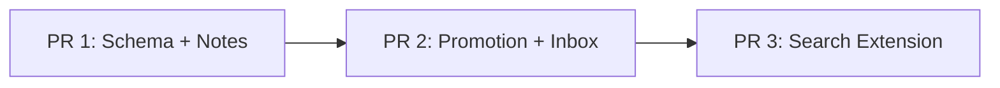

# Plan: Stock + Note 機能（Flow×Stock PKM Phase 2）

> Updated at: 2026-03-17 23:45

## Goal

既存のフロー（チャンネル + 投稿 + スレッド）に「昇格 → インボックス → ノート」のストック化パイプラインを追加する。
書き捨ての投稿が知識として蓄積されるデータ導線を実現する。

## Key Design Decisions

### 昇格のセマンティクス: コピー（元投稿は残る）
- 昇格は投稿のコンテンツを stocks テーブルに**コピー**する操作。元の投稿はフロー上にそのまま残る
- 元投稿には `is_promoted = true` のフラグが立ち、📌 バッジで視覚的に表示
- `source_post_ids` は JSON テキスト参照であり FK ではない。元投稿が削除されてもストックには影響しない

### stockTags テーブルの設計: タグテーブル直接方式
- 別途 `tags` マスターテーブルは作らない
- `stock_tags` は `stock_id` + `tag`（テキスト）で構成される直接テーブル
- `UNIQUE(stock_id, tag)` で同一ストック内の重複を防止
- タグサジェストは `SELECT DISTINCT tag FROM stock_tags` で実現

### promoteThread のコンテンツ統合
- 親投稿 + 返信を `\n\n---\n\n` 区切りで結合して1つの stock コンテンツにする
- 各メッセージの先頭にタイムスタンプを付与（`**[2026-03-17 10:30]**\n内容`）
- 全メッセージの ID を `source_post_ids` に JSON 配列で保存

### 検索モーダルの拡張方式: CommandGroup 追加
- cmdk にはタブ機能がないため、新しい `CommandGroup heading="Notes"` を追加する方式で実装
- SearchResult 型を `type: "post" | "reply" | "note"` に拡張。notes は channelId/channelName がないため、group フィールドで代替表示

### マイグレーション戦略: drizzle-kit push
- マイグレーションファイルは生成しない。`bunx drizzle-kit push` で直接 DB に反映
- push 後に Supabase ダッシュボードで RLS ポリシーの適用を必ず確認

## PR Chain

> Total: 3 PRs
> Schema: PR1 で全新規テーブル + ALTER TABLE を一括追加

### Dependency Graph

```
Wave 1: [PR 1]        ← 依存なし
Wave 2: [PR 2]        ← PR 1 完了後
Wave 3: [PR 3]        ← PR 2 完了後
```



> **直列:** 3 PR は順番にマージ。PR 2 は PR 1 の stocks テーブル + サイドバー変更に依存。PR 3 は PR 2 のサイドバー変更と競合するため直列

### PR 1/3: Schema + Notes — スキーマ拡張 + ノート CRUD + サイドバー再構成

- **Pattern:** Foundation First
- **Branch:** feat/stock-note/1-3-schema-and-notes
- **Base:** main
- **Scope:** FR-1, FR-2, FR-3, FR-4, FR-5, FR-6, FR-7, FR-8
- **Depends on:** (none)
- **Releasable alone:** Yes — ノートの作成・閲覧・編集・削除が単独で機能する。is_promoted カラムは追加されるが未使用なので無害
- **Files:**
  - `src/db/schema.ts` — stocks, stockTags テーブル定義追加（RLS ポリシー含む）+ posts に isPromoted 追加
  - `src/app/actions/stocks.ts` — ストック（ノート）CRUD Server Actions + グループ/タグ取得
  - `src/app/(app)/notes/page.tsx` — ノート一覧ページ（status='note' のみ、グループ別表示）
  - `src/app/(app)/notes/[id]/page.tsx` — ノート詳細・編集ページ
  - `src/components/note-list.tsx` — グループ別ノート一覧コンポーネント
  - `src/components/note-editor.tsx` — Markdown textarea エディタ + タイトル + グループ + タグ
  - `src/components/tag-input.tsx` — タグ入力（過去タグサジェスト、小文字正規化、Enter で追加）
  - `src/components/group-select.tsx` — グループ選択（既存グループサジェスト + 新規入力）
  - `src/components/sidebar.tsx` — 📚 Notes セクション追加（グループ別ツリー）
  - `src/components/mobile-sidebar.tsx` — 同上
  - `src/app/(app)/layout.tsx` — Notes 関連データの取得追加
- **Steps:**
  1. `src/db/schema.ts`: Drizzle スキーマに stocks, stockTags テーブル追加
     - stocks: id(uuid), status(text), title(text), content(text), group(text nullable), sourcePostIds(text, JSON array), sourceChannelId(uuid, ref channels ON DELETE SET NULL), authorId(uuid, ref profiles), timestamps
     - stockTags: id(uuid), stockId(uuid, ref stocks ON DELETE CASCADE), tag(text), UNIQUE(stockId, tag)
     - RLS ポリシー: stocks は `auth.uid() = (SELECT auth_user_id FROM profiles WHERE id = stocks.authorId)` パターン。stockTags は `auth.uid() = (SELECT auth_user_id FROM profiles WHERE id = (SELECT author_id FROM stocks WHERE id = stock_tags.stock_id))` パターン
     - posts テーブルに `isPromoted` (boolean, default false) カラム追加
  2. `bunx drizzle-kit push` でスキーマを DB に反映。push 後に Supabase ダッシュボードで RLS ポリシー確認
  3. `src/app/actions/stocks.ts`: ノート CRUD — createNote, getNotes, getNoteById, updateNote, deleteNote。グループ一覧（DISTINCT group）・タグ一覧（DISTINCT tag）取得
  4. `src/components/tag-input.tsx`: タグ入力コンポーネント — 自由テキスト入力、過去タグのドロップダウンサジェスト、Enter で追加、小文字正規化、重複排除
  5. `src/components/group-select.tsx`: グループ選択コンポーネント — 既存グループのドロップダウン、新規グループの自由入力
  6. `src/components/note-editor.tsx`: ノート編集 — タイトル input、Markdown textarea（既存パターン）、グループ選択、タグ入力、保存/削除ボタン。新規パッケージ不要
  7. `src/components/note-list.tsx`: グループ別アコーディオン表示、各ノートのタイトル + タグ + 更新日時。グループなしノートはフラット表示（グループ付きの後に並べる）
  8. `src/app/(app)/notes/page.tsx`: ノート一覧 — getNotes (status='note') を呼び出し、note-list で表示。空状態対応。「新規ノート作成」ボタン
  9. `src/app/(app)/notes/[id]/page.tsx`: ノート詳細 — getNoteById で取得、note-editor で編集
  10. `src/components/sidebar.tsx`: Channels セクションの下に 📚 Notes セクション追加。グループ別折りたたみアコーディオン（件数表示）で全ノートタイトルをリンク表示
  11. `src/components/mobile-sidebar.tsx`: 同様に Notes セクション追加
  12. `src/app/(app)/layout.tsx`: getNotes を呼び出して Sidebar/MobileHeader に渡す

#### Deviations (実績)
- **file_added**: `src/components/notes-sidebar-section.tsx` — サイドバー Notes セクションを独立コンポーネントとして分離（sidebar.tsx の肥大化回避）
- **file_added**: `src/app/(app)/notes/new/page.tsx` — 新規ノート作成ページを追加（ノート一覧の「新規作成」ボタンの遷移先）

### PR 2/3: Promotion + Inbox — 昇格 + インボックス + ノートへ移動

- **Pattern:** Vertical Slice
- **Branch:** feat/stock-note/2-3-promotion-inbox
- **Base:** feat/stock-note/1-3-schema-and-notes
- **Scope:** FR-9, FR-10, FR-11, FR-12, FR-13, FR-14, FR-15, FR-16, FR-17, FR-18, FR-19, NFR-1
- **Depends on:** PR 1
- **Releasable alone:** Yes（PR 1 マージ済みの前提で）— 昇格・インボックス・ノート移動の全フローが機能する
- **Files:**
  - `src/app/actions/stocks.ts` — 昇格 + インボックス操作を追加
  - `src/app/(app)/inbox/page.tsx` — インボックスページ
  - `src/components/inbox-list.tsx` — アイテム一覧（複数選択可能）
  - `src/components/move-to-note-modal.tsx` — ノートへ移動（CommandDialog ベース）
  - `src/components/promote-dialog.tsx` — 昇格確認ダイアログ（タイトル入力）
  - `src/components/post-item.tsx` — 📌バッジ + 昇格ボタン追加
  - `src/components/post-list.tsx` — 選択モード状態管理 + 一括昇格バー
  - `src/components/sidebar.tsx` — 📥 Inbox 追加（バッジ付き）
  - `src/components/mobile-sidebar.tsx` — 同上
  - `src/app/(app)/layout.tsx` — Inbox カウント取得追加
  - `src/app/(app)/channels/[id]/page.tsx` — posts に isPromoted を含めて取得
- **Steps:**
  1. 昇格 Server Actions（stocks.ts に追加）:
     - `promotePost(postId, title?)` — 投稿コンテンツを stocks にコピー（status='inbox'）、posts.is_promoted = true に更新。タイトル省略時は投稿冒頭30文字
     - `promoteThread(postId, title?)` — 親投稿 + 返信を取得し、タイムスタンプ付きで `\n\n---\n\n` 結合してコピー。全 ID を source_post_ids に保存
     - `promoteMultiple(postIds[], title?)` — 複数投稿を同様に結合してコピー
     - 重複防止: is_promoted = true の投稿はスキップ（エラーではなく無視）
  2. インボックス操作 Server Actions:
     - `getInboxItems()` — WHERE status='inbox' ORDER BY created_at DESC
     - `getInboxCount()` — COUNT WHERE status='inbox'（サイドバーバッジ用）
     - `moveToNote(stockId, group?, tags?)` — UPDATE SET status='note', group=?
     - `mergeIntoNote(stockId, targetNoteId)` — 既存ノートの content に `\n\n---\n\n` + inbox content を追記、元 inbox は削除
     - `moveMultipleToNote(ids[], group?, tags?)` — 一括 UPDATE SET status='note'
  3. `src/components/post-item.tsx`: ホバー時ツールバーに昇格ボタン（Archive アイコン）追加。is_promoted = true の投稿にタイムスタンプ横 📌 バッジ表示
  4. `src/components/post-list.tsx`: ホバーメニューのチェックボックスで1件選択 → 選択モードに入る。selectedIds 管理。画面下部に一括昇格バー表示（「N件を昇格」+「キャンセル」）
  5. `src/components/promote-dialog.tsx`: 昇格確認ダイアログ — タイトル入力（デフォルト: 投稿冒頭30文字）
  6. `src/components/inbox-list.tsx`: インボックスアイテム一覧 — 複数選択チェックボックス、元チャンネルへのリンク（source_channel_id）、削除ボタン、ノートに移動ボタン。空状態対応
  7. `src/components/move-to-note-modal.tsx`: CommandDialog ベース — 「新規ノートとして保存」選択肢 + 既存ノート検索・選択（mergeIntoNote）
  8. `src/app/(app)/inbox/page.tsx`: インボックスページ — getInboxItems() で一覧表示
  9. サイドバーに 📥 Inbox 追加（getInboxCount() でバッジ表示）
  10. layout.tsx に Inbox カウント取得を追加
  11. `src/app/(app)/channels/[id]/page.tsx`: getPosts 結果に isPromoted を含め、PostList に渡す

### PR 3/3: Search Extension — ストック横断検索

- **Pattern:** Vertical Slice
- **Branch:** feat/stock-note/3-3-search-extension
- **Base:** feat/stock-note/2-3-promotion-inbox
- **Scope:** FR-20
- **Depends on:** PR 2
- **Releasable alone:** Yes — 検索の拡張のみ、なくても他機能は動く
- **Files:**
  - `src/app/actions/search.ts` — searchStocks 追加、結果を統合
  - `src/components/search-modal.tsx` — Notes 用 CommandGroup 追加
- **Steps:**
  1. `src/app/actions/search.ts`:
     - `searchStocks(query)` 追加 — stocks.title と stocks.content に対して `similarity()` で検索。結果に group, status を含む
     - 既存の `searchPosts` を `searchAll(query)` にリネームまたはラップし、posts + stocks を統合して返す
     - SearchResult 型を拡張: `type: "post" | "reply" | "note"` + `group?: string`（notes 用）。channelId/channelName は notes の場合は空文字列
  2. `src/components/search-modal.tsx`:
     - 新しい `CommandGroup heading="Notes"` を追加（タブ UI ではなく既存パターンの拡張）
     - ノート結果: タイトル + グループ + タグ表示
     - ノート結果クリックで `/notes/[id]` にジャンプ

## Premortem

| リスク | 影響度 | 発生確率 | 復旧方法 |
|--------|--------|----------|----------|
| `drizzle-kit push` で RLS ポリシー適用漏れ | High | Medium | push 後に Supabase ダッシュボードで `pg_policies` 確認。手動 SQL での補完手段を用意 |
| stockTags の RLS サブクエリがパフォーマンス問題を起こす | Medium | Low | stockTags に authorId を直接追加してフラット化する代替案を用意 |
| posts に isPromoted カラム追加で既存クエリに影響 | Medium | Low | デフォルト false で追加、既存コードは select() で全カラム取得するが boolean デフォルトで影響なし |
| サイドバー変更で PR 間コンフリクト | Medium | Medium | PR を直列にし、各 PR で最新 base をリベース |
| 昇格元投稿の削除後、stocks の source_post_ids が orphan 化 | Low | Medium | source_post_ids は参照情報のみ（FK なし）。UI 側でリンク切れを graceful に処理 |
| グループ/タグの自由入力で表記ゆれ | Low | High | タグは小文字正規化で軽減。グループはサジェストで既存候補を提示 |

## Deep Plan Decisions (Resolved)

| ID | PR | Question | Decision |
|----|----|----------|----------|
| DK-1.2 | PR 1 | グループなしノートの表示 | フラット表示（グループ見出しなし、グループ付きノートの後に並べる） |
| DK-1.3 | PR 1 | サイドバーのノート表示 | 全ノート折りたたみ（グループ別アコーディオン、件数表示） |
| BD-2.1 | PR 2 | 複数投稿選択モード | ホバーメニューにチェックボックス追加。1つ選ぶと選択モードに入り、一括操作バー表示 |

## Constraints

- Server Actions のみ、API Routes 不使用
- 新規パッケージ追加なし（既存の cmdk / shadcn/ui で実装）
- Supabase Auth + profiles テーブルによる認証（既存パターン踏襲）
- PostgreSQL の pg_trgm（similarity）を検索に使用
- テストは書かない
- drizzle-kit push ベースでスキーマ反映
- 既存 Phase 1 機能（チャンネル、投稿、スレッド、検索）を壊さないこと（NFR-2）
