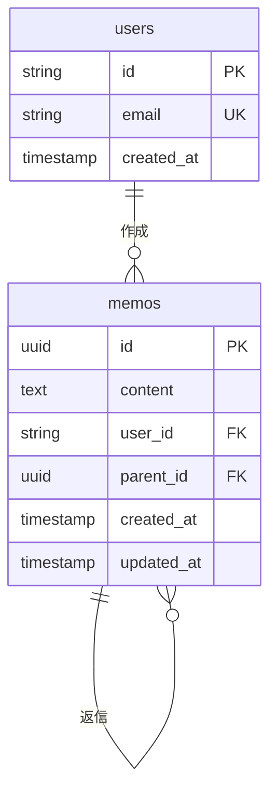

# Thread データベーススキーマ仕様書

## 1. 概要

本文書は、Threadアプリケーションにおけるデータベーススキーマの設計仕様を定義します。
スレッド型メッセージシステムを実現するためのテーブル構造、制約条件、インデックス戦略について記述します。

## 2. データベース構成

### 2.1 使用技術

- **RDBMS**: PostgreSQL
- **ホスティング**: Supabase
- **ORM**: Prisma
- **認証**: Supabase Auth

### 2.2 スキーマ命名規則

- テーブル名: 複数形のスネークケース（例: `users`, `memos`）
- カラム名: スネークケース（例: `user_id`, `created_at`）
- 外部キー: `{参照元テーブル}_id`形式

## 3. テーブル定義

### 3.1 users テーブル

#### 3.1.1 概要

Supabase Authと連携するユーザー情報を格納するテーブル

#### 3.1.2 カラム定義

| カラム名   | データ型  | 制約                    | 説明                      |
| ---------- | --------- | ----------------------- | ------------------------- |
| id         | VARCHAR   | PRIMARY KEY             | Supabase AuthのユーザーID |
| email      | VARCHAR   | UNIQUE, NOT NULL        | ユーザーのメールアドレス  |
| created_at | TIMESTAMP | NOT NULL, DEFAULT NOW() | アカウント作成日時        |

#### 3.1.3 制約条件

- **主キー**: `id`
- **一意制約**: `email`
- **外部キー**: なし

#### 3.1.4 インデックス

```sql
CREATE UNIQUE INDEX idx_users_email ON users(email);
```

### 3.2 memos テーブル

#### 3.2.1 概要

メッセージ（メモ）データを格納するコアテーブル。スレッド構造を自己参照で実現

#### 3.2.2 カラム定義

| カラム名   | データ型  | 制約                                    | 説明                         |
| ---------- | --------- | --------------------------------------- | ---------------------------- |
| id         | UUID      | PRIMARY KEY, DEFAULT uuid_generate_v4() | メッセージの一意識別子       |
| content    | TEXT      | NOT NULL                                | メッセージ本文               |
| user_id    | VARCHAR   | NOT NULL, FOREIGN KEY                   | 投稿者のユーザーID           |
| parent_id  | UUID      | NULLABLE, FOREIGN KEY                   | 親メッセージID（スレッド用） |
| created_at | TIMESTAMP | NOT NULL, DEFAULT NOW()                 | 作成日時                     |
| updated_at | TIMESTAMP | NOT NULL, DEFAULT NOW()                 | 最終更新日時                 |

#### 3.2.3 制約条件

- **主キー**: `id`
- **外部キー**:
  - `user_id` → `users(id)`
  - `parent_id` → `memos(id)`
- **チェック制約**: `parent_id != id` (自己参照防止)

#### 3.2.4 インデックス

```sql
-- 親メッセージによる検索用
CREATE INDEX idx_memos_parent_id ON memos(parent_id);

-- ユーザーによる検索用
CREATE INDEX idx_memos_user_id ON memos(user_id);

-- 時系列ソート用
CREATE INDEX idx_memos_created_at ON memos(created_at DESC);

-- メインメッセージ検索用（parent_idがNULL）
CREATE INDEX idx_memos_main_messages ON memos(created_at DESC) WHERE parent_id IS NULL;

-- 複合インデックス：特定の親メッセージの返信を時系列で取得
CREATE INDEX idx_memos_replies ON memos(parent_id, created_at ASC) WHERE parent_id IS NOT NULL;
```

## 4. リレーションシップ

### 4.1 テーブル間関係



### 4.2 関係の説明

- **users → memos**: 1対多（一人のユーザーは複数のメッセージを投稿可能）
- **memos → memos**: 1対多（一つのメッセージは複数の返信を持つ可能）

## 5. データ操作パターン

### 5.1 基本クエリパターン

#### 5.1.1 メインメッセージ一覧取得

```sql
SELECT m.*, u.email
FROM memos m
JOIN users u ON m.user_id = u.id
WHERE m.parent_id IS NULL
ORDER BY m.created_at DESC;
```

#### 5.1.2 特定メッセージのスレッド取得

```sql
SELECT m.*, u.email
FROM memos m
JOIN users u ON m.user_id = u.id
WHERE m.parent_id = $1
ORDER BY m.created_at ASC;
```

#### 5.1.3 スレッド階層の完全取得（再帰CTE）

```sql
WITH RECURSIVE thread_tree AS (
  -- ルートメッセージ
  SELECT id, content, user_id, parent_id, created_at, 0 as level
  FROM memos
  WHERE id = $1

  UNION ALL

  -- 子メッセージ
  SELECT m.id, m.content, m.user_id, m.parent_id, m.created_at, tt.level + 1
  FROM memos m
  JOIN thread_tree tt ON m.parent_id = tt.id
)
SELECT * FROM thread_tree ORDER BY level, created_at;
```

## 6. セキュリティ仕様

### 6.1 Row Level Security (RLS)

#### 6.1.1 users テーブル

```sql
-- ユーザーは自分の情報のみ閲覧可能
CREATE POLICY "Users can view own profile" ON users
  FOR SELECT USING (auth.uid() = id);

-- ユーザーは自分の情報のみ更新可能
CREATE POLICY "Users can update own profile" ON users
  FOR UPDATE USING (auth.uid() = id);
```

#### 6.1.2 memos テーブル

```sql
-- 認証済みユーザーは全てのメッセージを閲覧可能
CREATE POLICY "Authenticated users can view all memos" ON memos
  FOR SELECT USING (auth.role() = 'authenticated');

-- ユーザーは自分のメッセージのみ作成可能
CREATE POLICY "Users can create own memos" ON memos
  FOR INSERT WITH CHECK (auth.uid() = user_id);

-- ユーザーは自分のメッセージのみ更新可能
CREATE POLICY "Users can update own memos" ON memos
  FOR UPDATE USING (auth.uid() = user_id);

-- ユーザーは自分のメッセージのみ削除可能
CREATE POLICY "Users can delete own memos" ON memos
  FOR DELETE USING (auth.uid() = user_id);
```

## 7. パフォーマンス考慮事項

### 7.1 インデックス戦略

- **created_at DESC**: 新着順表示用
- **parent_id, created_at ASC**: スレッド内時系列表示用
- **user_id**: ユーザー別メッセージ検索用

### 7.2 クエリ最適化

- メインメッセージ取得時は`WHERE parent_id IS NULL`でPartial Index使用
- スレッド取得時は`parent_id`インデックスを活用
- 大量データ対応のためのページネーション実装推奨

## 8. 拡張性検討

### 8.1 将来的な拡張項目

- **添付ファイル**: `attachments`テーブルの追加
- **メッセージ昇格**: `promoted_messages`テーブルまたはフラグカラムの追加

### 8.2 スケーラビリティ対応

- パーティショニング（日付ベース）
- 読み取り専用レプリカの活用
- キャッシュ層の導入検討
