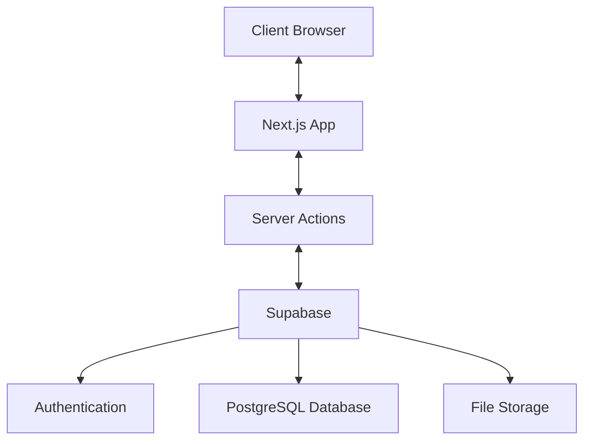
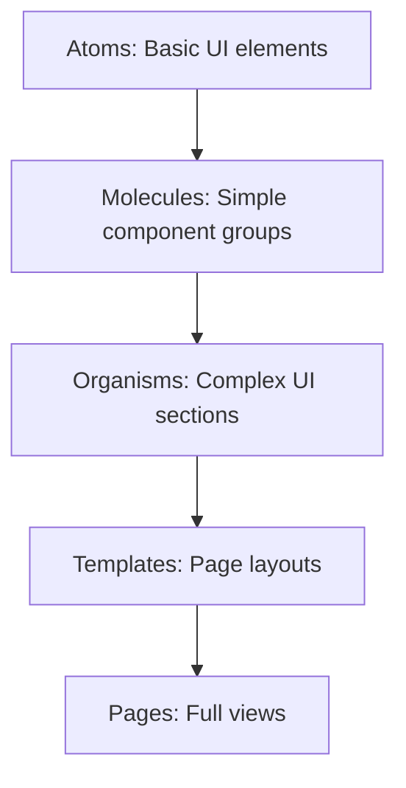
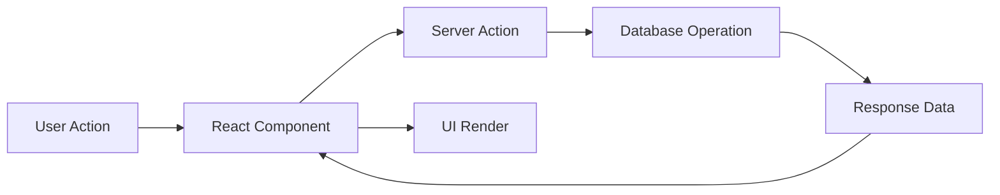
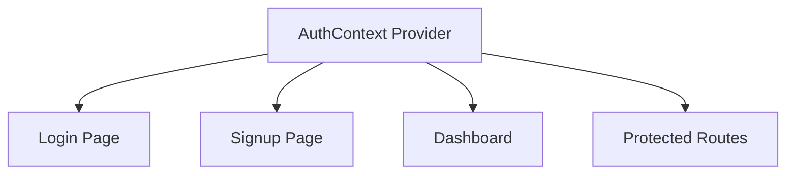
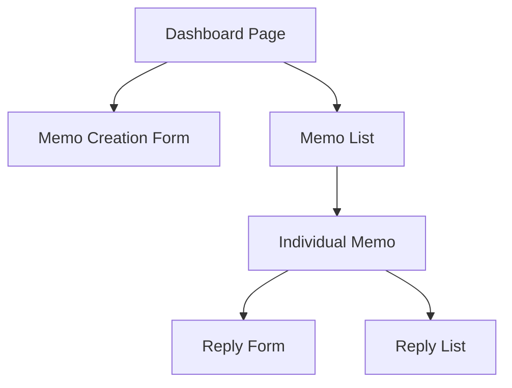

# Thread - System Patterns

## System Architecture

Thread follows a modern full-stack architecture with clear separation of concerns:

### Key Components

1. **Frontend Layer**
   - Next.js 15 with App Router
   - React components for UI
   - Client-side state management
   - Tailwind CSS for styling

2. **Server Layer**
   - Next.js Server Actions for API functionality
   - Server-side rendering and data fetching
   - Authentication handling

3. **Data Layer**
   - Supabase PostgreSQL database
   - Kysely as the query builder and ORM
   - Row Level Security for data protection
   - Supabase Storage for file uploads

## Design Patterns

### Component Architecture

Thread follows the Atomic Design methodology for component organization:

### State Management

- **Server State**: Managed through Server Actions and database queries
- **Client State**: React's useState and useContext for UI state
- **Authentication State**: Centralized AuthContext provider

### Data Flow

## Key Technical Decisions

### Next.js App Router

- Provides file-based routing
- Enables server components and server actions
- Supports efficient data fetching patterns

### Supabase Integration

- Simplifies authentication implementation
- Provides PostgreSQL database with Row Level Security
- Offers built-in storage solution for file uploads
- Enables real-time functionality

### Kysely ORM

- Type-safe SQL query builder
- Provides structured database access
- Enables complex queries with TypeScript support

### Tailwind CSS

- Utility-first CSS framework
- Enables rapid UI development
- Ensures consistent styling across components

## Component Relationships

### Authentication Flow

### Memo System

## Error Handling Strategy

- Client-side form validation
- Server-side validation in Server Actions
- Centralized error handling in API calls
- User-friendly error messages
- Fallback UI components for error states

## Security Patterns

- Authentication through Supabase Auth
- Row Level Security policies in database
- CSRF protection in form submissions
- Input sanitization
- Secure file upload handling
